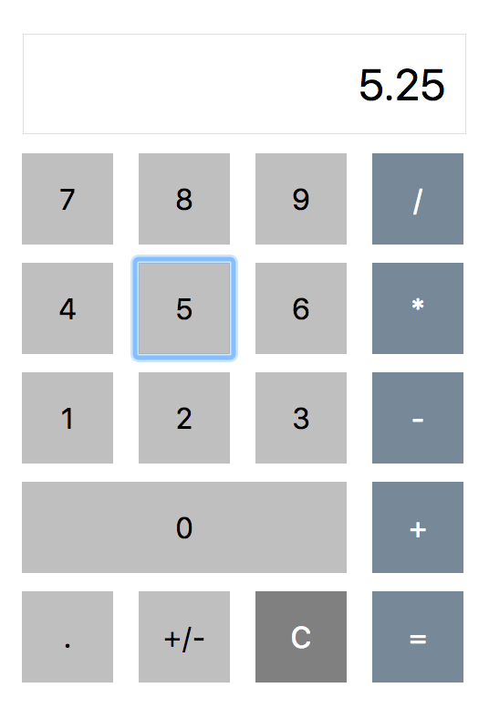

# Calculator (jQuery, Node, and Express): Basic calculator that can handle addition, subtraction, division and Multiplication. Can use decimal and negative numbers and validates data entry. The logic for the calculator is housed on the Server.

## Requirements
We are going to be building a calculator application using jQuery, Node, and Express!!

**BASE MODE**

The logic for the calculator needs to be housed on the Server, where the client side will take in the values (in 2 input text fields) and the type of mathematical operation (selected using a button on the DOM). Each of the numerical values and type of mathematical operation will be bundled up in an object and then sent to the server via a POST. So when the object is sent, it should look something like this: { x: 3, y: 4, type: Add }

Once the server receives it, build out logic to compute the numbers in 1 of 4 different ways. The server should be able to handle Addition, Subtraction, Multiplication, and Division. Once the calculation is complete, it should be sent back down to the client side app where it should be displayed on the DOM.

Finally, build a 'clear' button that resets the whole experience.

**HARD MODE**

Convert the input fields for the two values to Buttons. So the experience would allow the user to click on a numerical button, then a mathematical operation, then a numerical button again. Then have an equal button that sends all of the information to the server.

**PRO MODE**

Create a delay from when the client receives the response from the Server, and when the calculation is actually displayed on the DOM. The delay should be 3 seconds. During that delay, show information that says 'computing' until the 3 second delay has finished, then remove the 'computing' message while showing the calculation.

## Setup
1. Clone the repo to your computer using `git clone https://github.com/claudiacalderas/calculator.git`
2. Run `npm install`
4. Start the server by running `npm start`

## Screenshot

